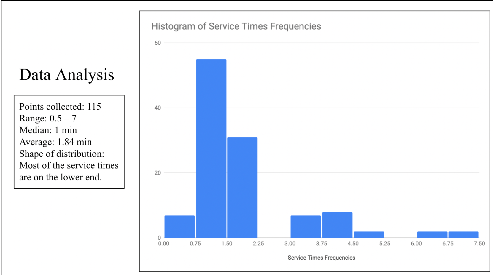

# RPCC Mailing Room Optimization

***Main Questions and Approaches:***
This project started in response to the long wait times first year students encountered at the RPCC mail pickup center. In context of that, our primary goal was to identify aspects of the campus mail distribution process that could be optimized to ultimately shorten waiting times. In pursuing this question, our approach was to maximize our understanding and relevant observations of the campus mail distribution process specific to Cornell, and apply relevant knowledge from statistics and optimization/operations research literature for useful insights on the data and practical solutions we could implement. We obtained these observations by sending groups of members of the student teams to RPCC to record the experiences of the employees working at the service desk, and again to collect data of students who came to collect packages based on the variables we identified as important in understanding the process.

**Data Collection:**
Before collecting this observable data, we spent time coming up with a protocol requiring at least two people that would give us relevant insight into the logistics of the queue. Ultimately, we recorded the students’ arrival times, departure times, changes in numbers of staff available, service times per request, and the type of service request (e.g. retrieving package vs. retrieving envelope vs. processing netID issue.) One team member recorded items for the left columns A-C of the google sheet primarily related to students’ arrival times. Another team member recorded the right side, columns D-G, for students’ departure times.
The general procedure the team decided on is as follows:
1. The initial number of students presented in the queue needs to be recorded when
the collection starts, and the final number of students in the queue also needs to be recorded when we finish our collection. (For example, our data starts with two students already in the line at 5 pm and ends with twelve students in the line at 7 p.m.)
2. Whenever a student enters the line, person A records down the time. Person A is also responsible for keeping track of any premature departures (i.e. quantity of students that leave the queue prematurely due to any reason.)
3. Whenever a student has their request processed, person B records down the time and notes whether the student was serving by staff #1 or staff #2. Person B also records the time it takes them to get their request fulfilled (the time between when they get to the front of the queue and when they exit the queue)
4. Person B is also responsible for keeping track of the type of the package, e.g. whether it is a package, a key, an envelope, etc.

We analyzed the package retrieval data provided by administration as well as the data we collected based on our observations of RPCC. Through our analysis of the package retrieval data, we obtained detailed frequency data that showed us each mailroom’s busiest days in the school year. Due to the large volume of frequency graphs for this analysis, they are all listed in the Appendix at the bottom of this document.
We also analyzed the data we collected by observing the queue at RPCC during a busy shift on Monday 5pm-7pm. This gave us insight into the volume and pattern of student arrival and departure activity during busy shifts. Our statistical analysis also includes other values of interest, such as the median for service time, and is shown below.

**Programmed Mail Processing Simulation**
We currently use the M/M/2 queuing model to compute figures for/model the dynamics of the RPCC mailing center– although as we continue to refine this model, it will need to reflect a more nuanced nature of RPCC (such as accounting for the fact that the number of employees processing service desk request frequently changes.) The team programmed a simulation of this using Python in Google Colab.

In our model, arrival times and amount of service times are generated from an exponentially distributed random variable with mean 1. The simulation accounts for typical operating hours from 8am-10pm. Our model operates using two servers constantly working in parallel; a new student is added to the queue based on randomly generated arrival times, and student requests are processed based on staff availability. The time for their request to be processed is the randomly generated service time. If a staff member is currently serving a student, they are unable to serve the next student in the queue until the time for the request to be processed is over. Once the staff is available again, that staff will begin to serve a new student from the queue, and the cycle repeats.

Our program’s functions can be described through three of its functions. The process runs through the function increment_time(), which goes through operating hours and at the end, based on what arrival times have been randomly generated, has created a list of all departure times within 8am - 10pm Monday-Friday business hours. The function service_time() is used to generate the service time. It tells us how long something takes to process. We set its parameter mu=1 and size=10000 (representing an exponentially distributed random variable with mean 1, with a large number 10000 points so that the generated point reflects as random a point as possible from a large graph of the distribution.)

Lastly, we have another function process_request() that simulates the employees of the service desk processing requests, which adds to the departure times list when a student’s request has been processed. As a result, the model calculates and outputs 1) the average expected number of people in the system and 2) average service time.
